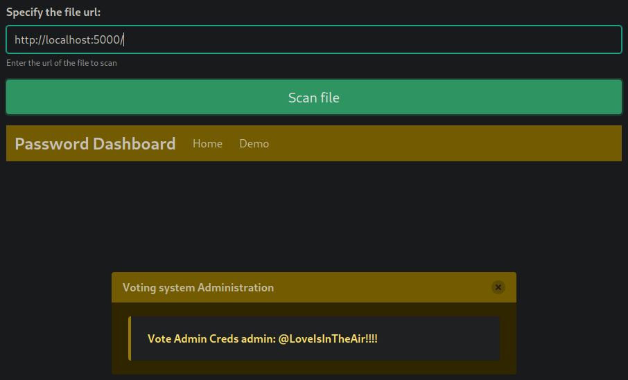

# Love

- **Plataforma:** HTB 
- **Fecha de resolución:** 16/07/2025
- **Autor:** Albr_0x4a

---

## Escaneo de Puertos con Nmap:

- **Identificar puertos abiertos:**

- **Comando:** nmap -p- -n -Pn --min-rate 5000 -sS 10.10.10.239

- **Identificar servicios y versiones en los puertos abiertos:**

- **Comando:** nmap -p80,135,139,443,445,3306,5000,5040,5985,5986,47001,49664,49665,49666,49667,49668,49669,49670 -sCV 10.10.10.239

- Revisando el escaneo hecho anteriormente, encontramos:
  - Por el puerto 80 un servicio web el cual tiene un formulario para iniciar sesión.

  

  -  Otro servicio web por el puerto 443 con el dominio staging.love.htb, el cual agregamos a nuestro archivo /etc/hosts e inspeccionamos en nuestro navegador. Nos encontramos con un escáner de archivos que nos permite ingresar una url del archivo a escanear, lo que nos inclina a pensar en un posible **SSRF**.

  

- Lanzamos un servidor web en local y efectivamente el servidor web es vulnerable a **SSRF**.

- Revisando un poco los otros servicios identificados en el escaner de nmap, nos encontramos con otro servicio web corriendo por el puerto 5000 el cual nos niega el acceso.

- Intentamos explotar el **SSRF** identificado anteriormente para obtener acceso a este servicio web, y logramos acceder a esta web el cual contiene credenciales.

- Al introducir las credenciales obtenidas, en el formulario que corre en el puerto 80, nos encontramos con que no son validas, así que revisamos otros servicios expuestos, como **SMB** por el puerto 445. Desafortunadamente no encontramos nada y después de un rato revisando otros servicios y haciendo fuzzing web nos encontramos con otro formulario de login en la ruta admin/login.php.

- Al introducir las credenciales obtenidas, logramos acceso exitoso y nos encontramos con un sistema de votación. Después de un rato revisando esta pagina, nos encontramos con que al actualizar la foto de perfil del usuario, no tenemos ningún tipo de mecanismo que valide el archivo subido, por lo que podemos subir un archivo php, y ejecutar comandos.

- De manera exitosa obtenemos un **RCE**, la cual podemos explotar para obtener acceso al sistema.

- Luego de confirmar que tenemos capacidad para ejecutar comandos, utilizamos una reverse shell para conectarnos a la máquina, yo utilicé el siguiente: [*php_reverse_shell.php*](https://github.com/ivan-sincek/php-reverse-shell/blob/master/src/reverse/php_reverse_shell.php)

- Dentro de la máquina Windows navegamos hasta el directorio `C:\Users\`, donde identificamos 2 usuarios: `Administrador` y `Phoebe`. Primero intentamos entrar al usuario `Administrador`, pero tenemos permisos insuficientes, asi que entramos al usuario `Phoebe`, y en su escritorio encontramos la primera flag.

- Para inspeccionar el sistema en busca de algún posible vector para escalar privilegios, nos descargamos el archivo [winPeas.exe](https://github.com/peass-ng/PEASS-ng/tree/master/winPEAS/winPEASexe) en nuestra máquina atacante, y lo enviamos a la máquina comprometida, esto lo hago mediante un servidor web con python.

- Luego de ejecutar este archivo, identificamos que tenemos habilitada la configuración `Always install with elevated privileges`, que permite al instalador de windows instalar programas con permisos administrativos. Dejo el siguiente recurso para más información sobre esta configuración: [Enlace](https://www.hackingarticles.in/windows-privilege-escalation-alwaysinstallelevated/)

- Para aprovecharnos de esta configuración creamos un archivo `.msi` que contenga una reverse shell, para eso utilizamos `msfvenom`.

- De la misma forma que con el archivo `winpeas`, lo enviamos a la máquina comprometida mediante un servidor web con python.

- Luego nos ponemos en escucha en el puerto indicado en nuestro reverse shell e instalamos el archivo con el comando `msiexec /quiet /qn /i exploit.msi`, y como resultado obtenemos acceso al sistema como usuario privilegiado.

- Navegamos a `C:\Users\Administrator\Desktop`, y podemos ver el archivo `root.txt`, que contiene nuestra última flag.

