# Outbound

- **Plataforma:** HTB 
- **Fecha de resolución:** 18/07/2025
- **Autor:** Albr_0x4a

---

## Escaneo de Puertos con Nmap:

- **Identificar puertos abiertos:**

- **Comando:** nmap -p- -n -Pn --min-rate 5000 -sS 10.10.11.77

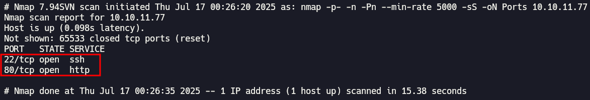

- **Identificar servicios y versiones en los puertos abiertos:**

- **Comando:** nmap -p22,80 -sCV 10.10.11.77

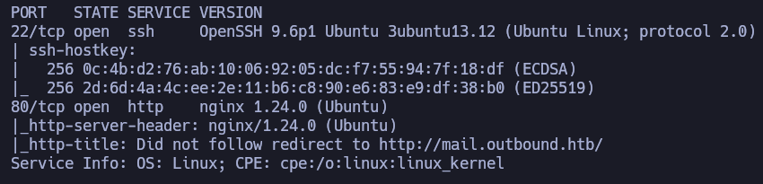

- Nmap nos muestra que tenemos abiertos el puerto 22 con ssh  y el puerto 80 con un servicio web, analizando este último nos encontramos con un dominio `mail.outbound.htb`, el cual junto a `outbound.htb` lo introducimos en nuestro archivo `/etc/hosts`, y procedemos a investigar este servicio web.

- Al entrar nos encontramos con una página para iniciar sesión en Roundcube(WebMail), utilizamos las credenciales que nos da HTB, y podemos entrar sin ningún problema.

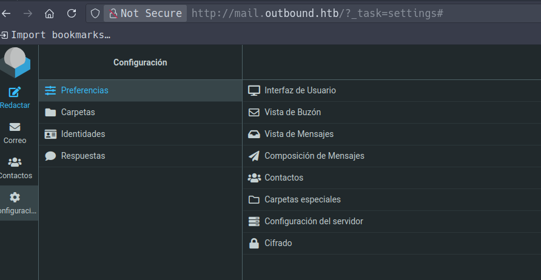

- Ya dentro lo primero que hacemos es revisar la versión de Roundcube a ver si tiene alguna vulnerabilidad conocida, y efectivamente nos encontramos con la versión `Roundcube Webmail 1.6.10`, la cual mediante una vulnerabilidad de deserialización nos permite explotar un **RCE**: [CVE-2025-49113](https://github.com/hakaioffsec/CVE-2025-49113-exploit)

- Para probar que podamos explotar sin ningún problema esta vulnerabilidad, nos ponemos en escucha en el puerto 2222 y levantamos un servidor web en python.

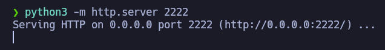

- Luego mediante el exploit obtenido en el enlace anterior, nos enviamos una solicitud con curl a nuestra web, y logramos confimar que es vulnerable.

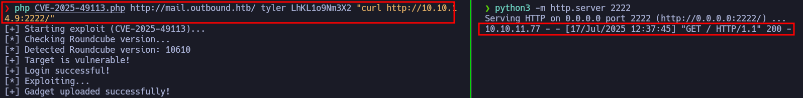

- Próximamente utilizamos esta vulnerabilidad para obtener acceso al sistema mediante una reverse shell, lo cual logramos exitosamente.

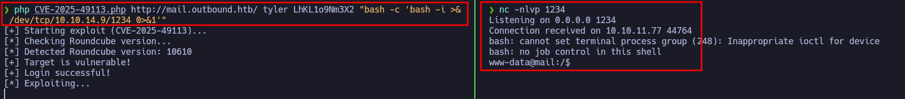

- Después de un rato enumerando el sistema e investigando sobre roundcube, nos encontramos con el archivo `config.inc.php`, el cual contiene credenciales para la base de datos, y una **key** utilizada para encriptar las contraseñas de los usuarios que se almacena en una tabla session, en la base de datos.

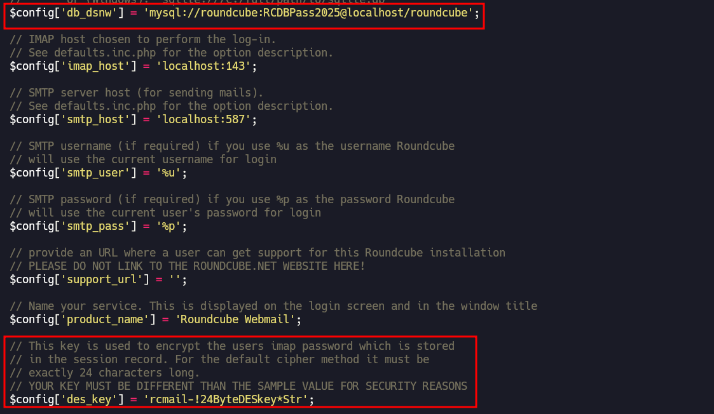

- Con esta información intentamos entrar en la base de datos y listar el contenido de la tabla `session`, lo cual logramos exitosamente

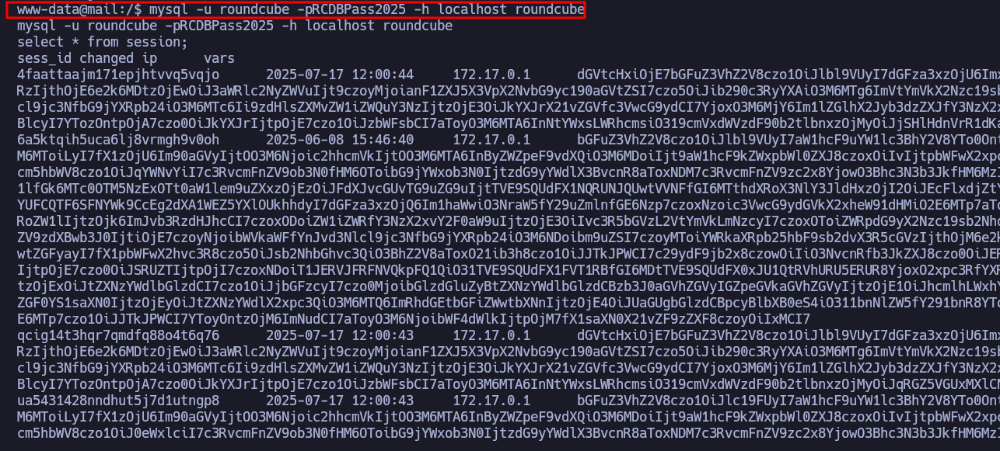

- El contenido de esta tabla se encuentra en base64, luego de descodificarlo nos encontramos con el usuario `jacob` y su contraseña encriptada codificada en base64.

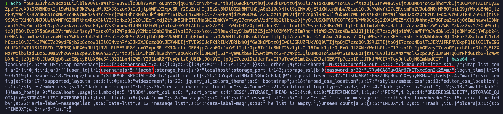

- Nuestro siguiente paso será desencriptar esta contraseña, para poder tener acceso como el usuario jacob, para esto podemos utilizar la misma función que utiliza roundcube para desencriptar la contraseña, esta se encuentra dentro del script `/var/www/html/roundcube/program/lib/Roundcube/rcube.php`.

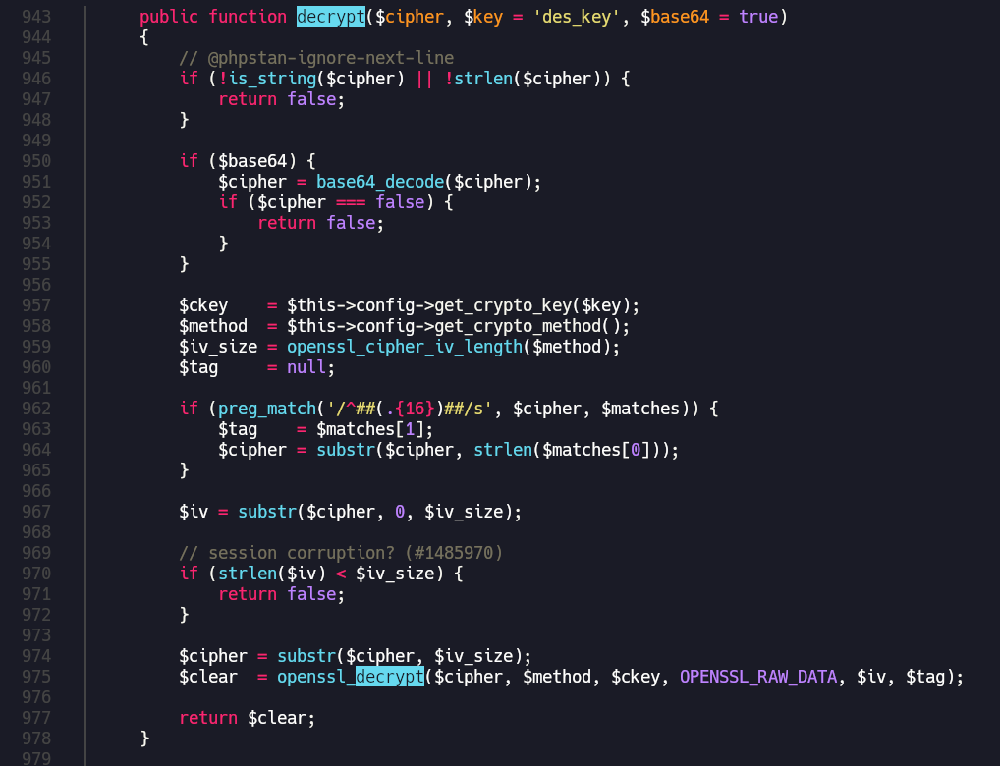

- Después de localizar la función, nos la copiamos a un archivo **php** e introducimos los datos necesarios para que funcione.

```php
<?php 
function decrypt($cipher, $base64 = true)
    {
        // @phpstan-ignore-next-line
        if (!is_string($cipher) || !strlen($cipher)) {
            return false;
        }

        if ($base64) {
            $cipher = base64_decode($cipher);
            if ($cipher === false) {
                return false;
            }
        }

        $ckey    = "rcmail-!24ByteDESkey*Str";
        $method  = "DES-EDE3-CBC";
        $iv_size = openssl_cipher_iv_length($method);
        $tag     = null;

        if (preg_match('/^##(.{16})##/s', $cipher, $matches)) {
            $tag    = $matches[1];
            $cipher = substr($cipher, strlen($matches[0]));
        }

        $iv = substr($cipher, 0, $iv_size);

        // session corruption? (#1485970)
        if (strlen($iv) < $iv_size) {
            return false;
        }

        $cipher = substr($cipher, $iv_size);
        $clear  = openssl_decrypt($cipher, $method, $ckey, OPENSSL_RAW_DATA, $iv, $tag);

        return $clear;
    }

echo decrypt("L7Rv00A8TuwJAr67kITxxcSgnIk25Am/");

?>
```

- Luego de ejecutar el script, obtenemos la contraseña del usuario **jacob**, con la cual podemos iniciar sesión en roundcube y ver sus correos, donde encontramos credenciales para conectarnos al sistema a través de ssh y obtener la primera flag.

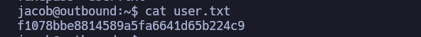

- Para escalar privilegios, ejecutamos `sudo -l` y vemos que podemos ejecutar con permisos de administrador el comando `/usr/bin/below`, con algunas limitaciones, luego de investigar un poco sobre este binario, nos encontramos con que la versión que tenemos tiene una vulnerabilidad crítica que nos permite escalar privilegios, dejo más información en este [enlace](https://www.openwall.com/lists/oss-security/2025/03/12/1)

- Para explotar esta vulnerabilidad primero tenemos que eliminar el archivo `/var/log/below/error_root.log`, luego creamos un enlace simbólico que apunte a `/etc/passwd`, a continuación ejecutamos `sudo /usr/bin/below record` el cual resultara en un error y gracias al enlace simbólico, lo escribirá en el archivo `/etc/passwd`, luego escribimos nuestro usuario falso y obtenemos acceso privilegiado.

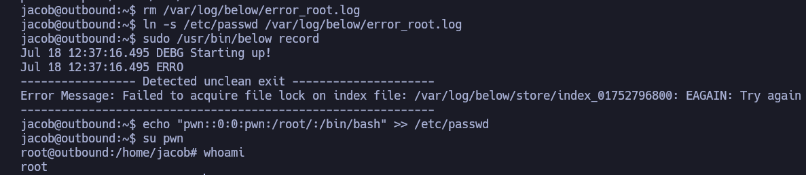

- Por último, navegamos hasta `/root` y obtenemos la flag.

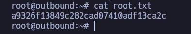
